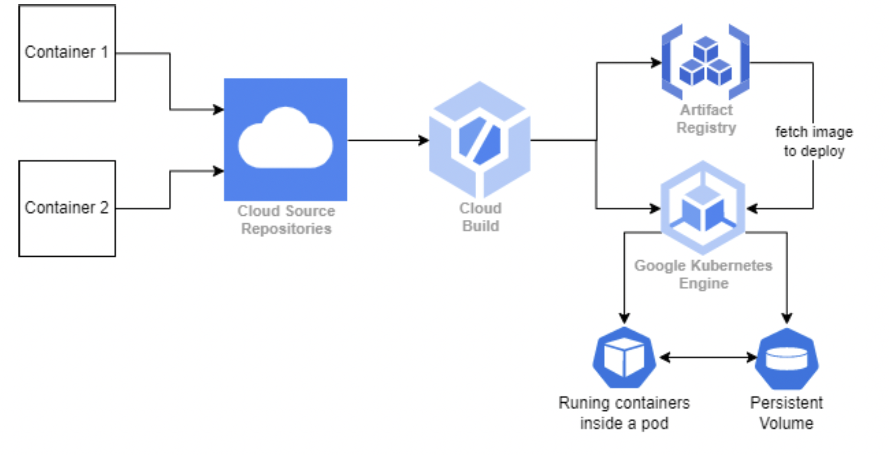

## K8s Microservice

### Project Overview
Two Microservices, which are deployed on Google Kubernetes Engine (GKE) with following technologies 

 - **microservices**: `Javascript, Node JS` was used. 
 - **containerization**: `Docker` 
 - **CI/CD**: `GCP Cloud Build` 
 - **container registry**: `GCP Artifact Registry` 
 - **k8s cluster**: `Google Kubernetes Engine (GKE)` 
 - **Infrastructure as Code (IaC)**: `Terraform` 

### Project Flow
https://youtu.be/8k2fgfvXY1A

### Project Architecture

